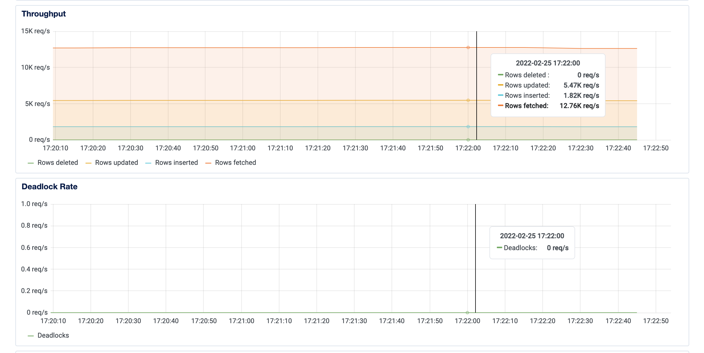

# Preliminary Load Test

## pg-osc: No downtime schema changes with 7K+ writes/s & 12k+ reads/s

This is a very basic load test performed with `pgbench` against a single instance PostgreSQL DB running on DigitialOcean with the following configuration:

- **128GB RAM**
- **32vCPU**
- **695GB Disk**
- Trasanction based connection pool with **500 pool limit**

Total time taken to run schema change: **<3mins**

## Simulating load with pgbench

**Initialize**
```
pgbench -p $PORT --initialize -s 20 -F 20 --foreign-keys --host $HOST -U $USERNAME  -d $DB 
```

This creates bunch of pgbench tables. The table being used with `pg-osc` is `pgbench_accounts` which has FKs and also references by other tables with FKS, containing 2M rows.

**Begin**
```
pgbench -p $PORT -j 72 -c 288 -T 500 -r --host $DB_HOST -U $USERNAME -d $DB  
```

## Running pg-osc

Simple `ALTER` statement for experimentation purposes.

```sql
ALTER TABLE pgbench_accounts ADD COLUMN "purchased" BOOLEAN DEFAULT FALSE;
```

**Execution**

```bash
bundle exec bin/pg-online-schema-change perform \ 
-a 'ALTER TABLE pgbench_accounts ADD COLUMN "purchased" BOOLEAN DEFAULT FALSE;' \
-d "pool" \
-p 25061
-h "..." \
-u "..." \
-w "..." \
```

## Outcome

**pgbench results**

```
number of transactions actually processed: 1060382
latency average = 144.874 ms
tps = 1767.057392 (including connections establishing)
tps = 1777.971823 (excluding connections establishing)
statement latencies in milliseconds:
         0.479  \set aid random(1, 100000 * :scale)
         0.409  \set bid random(1, 1 * :scale)
         0.247  \set tid random(1, 10 * :scale)
         0.208  \set delta random(-5000, 5000)
         3.136  BEGIN;
         4.243  UPDATE pgbench_accounts SET abalance = abalance + :delta WHERE aid = :aid;
         4.488  SELECT abalance FROM pgbench_accounts WHERE aid = :aid;
        71.017  UPDATE pgbench_tellers SET tbalance = tbalance + :delta WHERE tid = :tid;
        46.689  UPDATE pgbench_branches SET bbalance = bbalance + :delta WHERE bid = :bid;
         4.035  INSERT INTO pgbench_history (tid, bid, aid, delta, mtime) VALUES (:tid, :bid, :aid, :delta, CURRENT_TIMESTAMP);
         4.166  END;
```

**Metrics**


**New table structure**

Added `purchased` column.

```
defaultdb=> \d+ pgbench_accounts;
                                  Table "public.pgbench_accounts"
  Column   |     Type      | Collation | Nullable | Default | Storage  | Stats target | Description 
-----------+---------------+-----------+----------+---------+----------+--------------+-------------
 aid       | integer       |           | not null |         | plain    |              | 
 bid       | integer       |           |          |         | plain    |              | 
 abalance  | integer       |           |          |         | plain    |              | 
 filler    | character(84) |           |          |         | extended |              | 
 purchased | boolean       |           |          | false   | plain    |              | 
Indexes:
    "pgosc_st_pgbench_accounts_815029_pkey" PRIMARY KEY, btree (aid)
Foreign-key constraints:
    "pgbench_accounts_bid_fkey" FOREIGN KEY (bid) REFERENCES pgbench_branches(bid)
Referenced by:
    TABLE "pgbench_history" CONSTRAINT "pgbench_history_aid_fkey" FOREIGN KEY (aid) REFERENCES pgbench_accounts(aid)
Options: autovacuum_enabled=false, fillfactor=20
```

**Logs**

<details>
<summary>Logs from pg-osc</summary>

```json
{"name":"pg-online-schema-change","hostname":"MacBook-Pro.local","pid":13263,"level":30,"time":"2022-02-25T17:22:01.147-05:00","v":0,"msg":"Setting up audit table","audit_table":"pgosc_at_pgbench_accounts_714a8b","version":"0.4.0"}
{"name":"pg-online-schema-change","hostname":"MacBook-Pro.local","pid":13263,"level":30,"time":"2022-02-25T17:22:01.660-05:00","v":0,"msg":"Setting up triggers","version":"0.4.0"}
NOTICE:  trigger "primary_to_audit_table_trigger" for relation "pgbench_accounts" does not exist, skipping
{"name":"pg-online-schema-change","hostname":"MacBook-Pro.local","pid":13263,"level":30,"time":"2022-02-25T17:22:01.814-05:00","v":0,"msg":"Setting up shadow table","shadow_table":"pgosc_st_pgbench_accounts_714a8b","version":"0.4.0"}
{"name":"pg-online-schema-change","hostname":"MacBook-Pro.local","pid":13263,"level":30,"time":"2022-02-25T17:22:02.169-05:00","v":0,"msg":"Running alter statement on shadow table","shadow_table":"pgosc_st_pgbench_accounts_714a8b","parent_table":"pgbench_accounts","version":"0.4.0"}
{"name":"pg-online-schema-change","hostname":"MacBook-Pro.local","pid":13263,"level":30,"time":"2022-02-25T17:22:02.204-05:00","v":0,"msg":"Clearing contents of audit table before copy..","shadow_table":"pgosc_st_pgbench_accounts_714a8b","parent_table":"pgbench_accounts","version":"0.4.0"}
{"name":"pg-online-schema-change","hostname":"MacBook-Pro.local","pid":13263,"level":30,"time":"2022-02-25T17:22:02.240-05:00","v":0,"msg":"Copying contents..","shadow_table":"pgosc_st_pgbench_accounts_714a8b","parent_table":"pgbench_accounts","version":"0.4.0"}
{"name":"pg-online-schema-change","hostname":"MacBook-Pro.local","pid":13263,"level":30,"time":"2022-02-25T17:22:20.481-05:00","v":0,"msg":"Performing ANALYZE!","version":"0.4.0"}
INFO:  analyzing "public.pgbench_accounts"
INFO:  "pgbench_accounts": scanned 30000 of 166667 pages, containing 360000 live rows and 200 dead rows; 30000 rows in sample, 2000004 estimated total rows
{"name":"pg-online-schema-change","hostname":"MacBook-Pro.local","pid":13263,"level":30,"time":"2022-02-25T17:22:21.078-05:00","v":0,"msg":"Replaying rows, count: 2000","version":"0.4.0"}
{"name":"pg-online-schema-change","hostname":"MacBook-Pro.local","pid":13263,"level":30,"time":"2022-02-25T17:22:21.580-05:00","v":0,"msg":"Replaying rows, count: 2000","version":"0.4.0"}
{"name":"pg-online-schema-change","hostname":"MacBook-Pro.local","pid":13263,"level":30,"time":"2022-02-25T17:22:22.022-05:00","v":0,"msg":"Replaying rows, count: 2000","version":"0.4.0"}
{"name":"pg-online-schema-change","hostname":"MacBook-Pro.local","pid":13263,"level":30,"time":"2022-02-25T17:22:22.490-05:00","v":0,"msg":"Replaying rows, count: 2000","version":"0.4.0"}
{"name":"pg-online-schema-change","hostname":"MacBook-Pro.local","pid":13263,"level":30,"time":"2022-02-25T17:22:22.866-05:00","v":0,"msg":"Replaying rows, count: 661","version":"0.4.0"}
{"name":"pg-online-schema-change","hostname":"MacBook-Pro.local","pid":13263,"level":30,"time":"2022-02-25T17:22:23.212-05:00","v":0,"msg":"Replaying rows, count: 533","version":"0.4.0"}
{"name":"pg-online-schema-change","hostname":"MacBook-Pro.local","pid":13263,"level":30,"time":"2022-02-25T17:22:23.512-05:00","v":0,"msg":"Replaying rows, count: 468","version":"0.4.0"}
{"name":"pg-online-schema-change","hostname":"MacBook-Pro.local","pid":13263,"level":30,"time":"2022-02-25T17:22:23.809-05:00","v":0,"msg":"Remaining rows below delta count, proceeding towards swap","version":"0.4.0"}
{"name":"pg-online-schema-change","hostname":"MacBook-Pro.local","pid":13263,"level":30,"time":"2022-02-25T17:22:23.809-05:00","v":0,"msg":"Performing swap!","version":"0.4.0"}
{"name":"pg-online-schema-change","hostname":"MacBook-Pro.local","pid":13263,"level":30,"time":"2022-02-25T17:22:24.259-05:00","v":0,"msg":"Replaying rows, count: 449","version":"0.4.0"}
NOTICE:  trigger "primary_to_audit_table_trigger" for relation "pgbench_accounts" does not exist, skipping
{"name":"pg-online-schema-change","hostname":"MacBook-Pro.local","pid":13263,"level":30,"time":"2022-02-25T17:22:24.650-05:00","v":0,"msg":"Performing ANALYZE!","version":"0.4.0"}
INFO:  analyzing "public.pgbench_accounts"
INFO:  "pgbench_accounts": scanned 30000 of 32935 pages, containing 1821834 live rows and 6056 dead rows; 30000 rows in sample, 2000070 estimated total rows
{"name":"pg-online-schema-change","hostname":"MacBook-Pro.local","pid":13263,"level":30,"time":"2022-02-25T17:22:24.941-05:00","v":0,"msg":"Validating constraints!","version":"0.4.0"}
NOTICE:  table "pgosc_st_pgbench_accounts_714a8b" does not exist, skipping
{"name":"pg-online-schema-change","hostname":"MacBook-Pro.local","pid":13263,"level":30,"time":"2022-02-25T17:22:26.159-05:00","v":0,"msg":"All tasks successfully completed","version":"0.4.0"}
```

</details>


## Conclusion

By tweaking `PULL_BATCH_COUNT` to `2000` (replay 2k rows at once) and `DELTA_COUNT` to `200` (time to swap when remaining rows is <200), `pg-osc` was able to perform the schema change with no impact within very quick time. Depending on the database size and load on the table, you can further tune them to achieve desired impact. At some point this is going to plateau - I can imagine the replay factor not working quite well for say 100k commits/s workloads. So, YMMV.

`PULL_BATCH_COUNT` and `DELTA_COUNT` aren't configurable via CLI yet, but they will soon be.